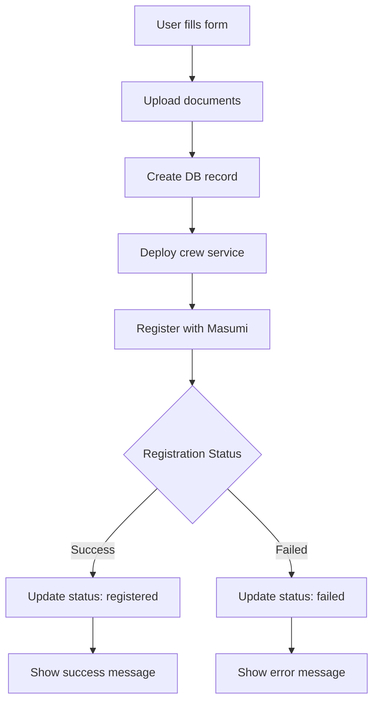

# AI Agent Deployment Implementation

This document summarizes the implementation of the AI agent deployment system following the Masumi Agent Deployment documentation.

## Overview

We've implemented a complete flow for creating, registering, and managing AI support agents that integrate with the Masumi Network for on-chain registration and payment processing.

## Implementation Components

### 1. Masumi Integration (`src/lib/masumi.ts`)
- **registerAgent()**: Registers agents with Masumi Registry
- **checkAgentStatus()**: Monitors registration progress
- **waitForRegistration()**: Polls until registration completes
- Uses native `fetch` API for HTTP requests
- Handles all Masumi API authentication and error cases

### 2. Agent Management (`src/lib/agents.ts`)
- **createAgent()**: Complete agent creation workflow
  - Validates user authentication
  - Uploads documents to Supabase Storage
  - Creates database record
  - Registers with Masumi
  - Updates status based on registration result
- **getUserAgents()**: Retrieves user's agents
- **getAgent()**: Gets single agent details
- **deleteAgent()**: Removes agents

### 3. Database Schema (`supabase/migrations/20240112_create_agents_table.sql`)
```sql
agents table:
- id (UUID, primary key)
- user_id (UUID, foreign key to auth.users)
- name (TEXT)
- description (TEXT)
- bio (TEXT)
- masumi_id (TEXT)
- api_url (TEXT)
- status (TEXT: 'pending', 'registered', 'failed')
- doc_urls (TEXT[])
- created_at (TIMESTAMP)
- updated_at (TIMESTAMP)
```

Row Level Security (RLS) policies ensure users can only access their own agents.

### 4. UI Integration (Dashboard Updates)
- Agent creation form with:
  - AI assistant for generating agent configurations
  - Business description prompt field
  - Name, bio, and description fields with regenerate options
  - Document upload support
  - Real-time status feedback via toast notifications
- Displays existing agents (currently using mock data)
- Admin mode support for privileged users

### 5. AI Assistant Integration (`src/lib/ai-service.ts`)
- **generateAgentConfig()**: Creates complete agent configuration from business description
- **regenerateField()**: Regenerates individual fields with context awareness
- OpenAI-compatible API support
- Configurable temperature and token limits

## Flow Diagram



## Environment Variables Required

```env
# Masumi Configuration
VITE_MASUMI_PAYMENT_URL=https://payment.masumi.network
VITE_MASUMI_API_KEY=your_api_key_with_PAY_scope
VITE_MASUMI_VKEY=your_selling_wallet_vkey
VITE_MASUMI_NETWORK=Preprod

# AI Service Configuration
VITE_AGENT_API_URL=https://api.openai.com/v1/chat/completions
VITE_AGENT_API_KEY=your_openai_api_key_here
```

## Current Status

### ✅ Implemented
- Masumi Registry integration
- Agent database schema and RLS policies
- Document upload to Supabase Storage
- Agent creation workflow
- Status tracking and error handling
- UI form integration with real-time feedback
- AI assistant for agent configuration generation
- Individual field regeneration with context
- Business description-based suggestions

### 🚧 TODO / Placeholder
- Actual crew service deployment (currently returns mock URL)
- Agent list refresh after creation
- Real agents display (currently showing mock data)
- Agent editing functionality
- Agent testing interface
- Stripe subscription verification

## Testing the Implementation

1. **Set up environment variables** (see `docs/MASUMI_ENV_SETUP.md`)

2. **Run the SQL migration**:
   ```sql
   -- Execute in Supabase SQL editor
   -- Copy contents of supabase/migrations/20240112_create_agents_table.sql
   ```

3. **Test agent creation**:
   - Connect wallet on Dashboard
   - Fill in agent details
   - Upload documentation files
   - Click "Create AI Agent"
   - Monitor toast notifications for progress

4. **Verify in Masumi Explorer**:
   - Check registration status
   - View on-chain transaction

## Security Considerations

- API keys are stored in environment variables
- User authentication required for all operations
- RLS policies enforce data isolation
- Document uploads restricted to authenticated users
- Masumi registration requires funded wallet

## Next Steps

1. **Implement crew service deployment**:
   - Set up FastAPI template
   - Configure multi-tenant or per-agent deployment
   - Return actual API URLs

2. **Add Stripe integration**:
   - Verify active subscriptions before agent creation
   - Implement usage limits

3. **Enhance UI**:
   - Live agent list updates
   - Agent performance metrics
   - Testing interface for agents

4. **Production readiness**:
   - Switch to Mainnet
   - Set up monitoring
   - Implement rate limiting 