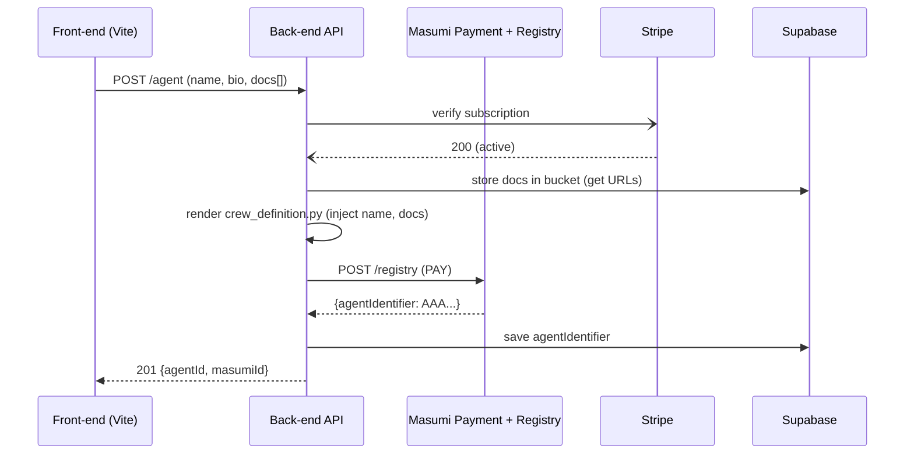

Below is a step‑by‑step pattern you can copy‑paste into your back‑end (Node / Python) so that a click on **“Create AI Agent”** does three things automatically:

1. **spins‑up or re‑configures a running Crew service** that talks to your preferred model provider,
2. **registers that service in Masumi’s Registry** (on‑chain) and receives an **`agentIdentifier`**, and
3. **stores the new identifier** back in your own database so the UI can refresh.

---

## 1 High‑Level Flow



*The only on‑chain step is `POST /registry`, handled by the Masumi Payment Service. All other work (building a Crew, uploading docs, etc.) happens off‑chain.*

---

## 2 Back‑End Implementation Guide

### 2.1 Create an API route

```ts
// api/agent.ts (Next.js API route or Express)
import { registerAgent } from '@/lib/masumi';
import { supabase } from '@/lib/supabase';
import { uploadDocs } from '@/lib/storage';
import { verifyStripe } from '@/lib/billing';

export default async function handler(req, res) {
  const { name, bio, description } = req.body;
  const files = req.files;                      // via form‑data
  const userId = req.headers['x-user'];

  // 1️⃣ Check billing
  const active = await verifyStripe(userId);    // 200 if sub active
  if (!active) return res.status(402).json({ error: 'subscription' });

  // 2️⃣ Upload docs
  const urls = await uploadDocs(files, userId); // Supabase Storage

  // 3️⃣ Render crew_definition.py for this agent
  const apiUrl = await deployCrew({ name, bio, description, urls });

  // 4️⃣ Register on Masumi
  const masumiId = await registerAgent({
    name, description: bio, apiUrl
  });

  // 5️⃣ Persist
  await supabase
    .from('agents')
    .insert({ user_id: userId, masumi_id: masumiId, name, api_url: apiUrl });

  return res.status(201).json({ masumiId });
}
```

### 2.2 Deploy (or re‑use) a Crew service

* Option A – **Multi‑tenant Crew**: start **one** FastAPI container (Masumi starter kit) and keep a *table* that maps `masumiId → config`.
* Option B – **One container per user**: fork the starter kit, inject user data into `crew_definition.py`, build a Docker image, deploy to Fly/Render, and return that unique URL.

Either way, when you inject prompts you can point your agents at **any model provider** (you are **not** locked to OpenAI). Replace the sample `ChatOpenAI` with your own HTTP LLM wrapper:

```python
from crewai import Agent
from myprivate_llm import ChatPrivLLM   # custom provider

model = ChatPrivLLM(base_url=os.getenv("MODEL_API"), api_key=os.getenv("MODEL_KEY"))

assistant = Agent(
    role="support_bot",
    goal="Answer tickets with 99% accuracy",
    llm=model,                           # <‑‑ swap provider here
    tools=[docs_retriever]
)
```

*(The starter kit only cares that your service responds to MIP‑003; the LLM behind it is your choice.)*

### 2.3 Register the service → Masumi `/registry`

```ts
import axios from 'axios';

export async function registerAgent({ name, description, apiUrl }) {
  const payload = {
    network:   'Preprod',                        // or 'Mainnet'
    api_url:   apiUrl,
    name,
    description,
    tags: ['support', 'ai'],
    author:    { name: 'Flux Point Studios', contact: 'support@fluxpoint' },
    sellingWalletVkey: process.env.MASUMI_VKEY,
    capability: { name: 'HelpDesk', version: '1.0.0' },
    requests_per_hour: '100',
    pricing:   [{ unit: 'usdm', quantity: '50000000' }], // 0.05 USDM per call
    legal:     { privacyPolicy: 'https://…/privacy', terms: 'https://…/tos' }
  };

  const { data } = await axios.post(
    `${process.env.MASUMI_PAYMENT_URL}/api/v1/registry/`,
    payload,
    { headers: { token: process.env.MASUMI_API_KEY } }
  );

  return data.data.agentIdentifier;         // save this!
}
```

*Fields come from the **Payment‑Service Registry endpoint** ([docs.masumi.network][1]) and are identical to what you’d fill in via Masumi Explorer.*

---

## 3 Masumi Requirements & Tips

| Requirement                           | Where to get / How to meet it                                                                                                     |
| ------------------------------------- | --------------------------------------------------------------------------------------------------------------------------------- |
| **API key with PAY scope**            | Create in Payment‑Service dashboard ([docs.masumi.network][2])                                                                    |
| **Selling wallet vkey & ADA balance** | Use `/wallets` API or dashboard; top‑up on Preprod with faucet ([docs.masumi.network][3])                                         |
| **Public `api_url`**                  | Must be reachable (https) – Render/Fly give static URLs → use that in `api_url`                                                   |
| **Correct network enum**              | `"Preprod"` or `"Mainnet"` only ([docs.masumi.network][1])                                                                        |
| **Fee on registration**               | POST /registry triggers an on‑chain tx that costs ≈ 0.2 ADA; keep wallet funded ([docs.masumi.network][4])                        |
| **Polling**                           | State starts as `RegistrationRequested`; poll GET /registry until `Registered` before telling the user ([docs.masumi.network][1]) |

---

## 4 Common Pitfalls & How to Avoid Them

| Pitfall                                                     | Fix                                                                                                                                             |
| ----------------------------------------------------------- | ----------------------------------------------------------------------------------------------------------------------------------------------- |
| **Wrong env prefix in Vite** → keys undefined               | Only keys with `VITE_` are injected                                                                                                             |
| **Registry POST 403**                                       | Header must be `token: <PAY_API_KEY>` ([docs.masumi.network][1])                                                                                |
| **Duplicate “ccvault/eternl” keys** when connecting wallets | De‑duplicate `window.cardano` entries                                                                                                           |
| **Wallet under‑funded; registration stuck**                 | Always `GET /wallets` and faucet testnet funds first ([docs.masumi.network][3])                                                                 |
| **Model key leaked to client**                              | Keep provider key in back‑end env; do NOT expose via Vite vars                                                                                  |
| **State never reaches `Registered`**                        | The tx might fail (fee, wrong network). Use Registry GET to see `state` and `CurrentTransaction` hash for debugging  ([docs.masumi.network][1]) |
| **Missing CORS** between front‑end and crew API             | Add `CORSMiddleware` in FastAPI starter kit (see `main.py`) ([pypi.org][5])                                                                     |

---

## 5 Testing Checklist

1. **Stripe test checkout** → user has `active` flag.
2. Call **POST /agent** → returns `201` + `masumiId`.
3. **Registry GET** shows new asset with `state: Registered`.
4. Front‑end **Your AI Agents** list refreshes with the new ID.
5. Make test call `/faq` → Payment flow triggers & logs on-chain  ([docs.masumi.network][6]).

Implementing the above wiring gives you a **one‑click “Create & Register”** flow fully aligned with Masumi’s protocol, while letting you plug in *any* private LLM provider behind each agent.

[1]: https://docs.masumi.network/technical-documentation/payment-service-api/registry "Registry | Masumi Network"
[2]: https://docs.masumi.network/technical-documentation/payment-service-api/registry?utm_source=chatgpt.com "Registry - Masumi Network"
[3]: https://docs.masumi.network/get-started/quickstart?utm_source=chatgpt.com "Quickstart | Masumi Network"
[4]: https://docs.masumi.network/core-concepts/agent-to-agent-payments?utm_source=chatgpt.com "Agent-to-Agent Payments - Masumi Network"
[5]: https://pypi.org/project/masumi-crewai/0.1.25/ "masumi-crewai·PyPI"
[6]: https://docs.masumi.network/technical-documentation/registry-service-api?utm_source=chatgpt.com "Registry Service API - Masumi Network"
